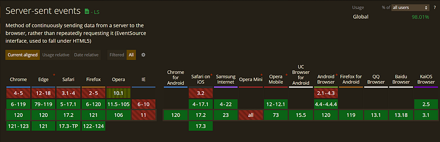
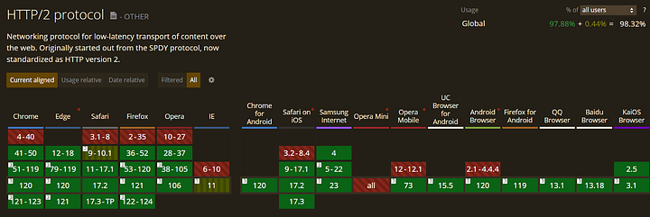

# Нативные подписки с роутером Cosmo

Федеративный GraphQL бесценен для предприятий, потому что он создает единый, логический уровень API - федеративный граф, - который соединяет разрозненные источники данных, служа единым представлением о ландшафте данных организации.

Сервисы могут обеспечивать взаимодействие, но при этом оставаться независимыми и использовать технологии, с которыми они знакомы, благодаря общей и стандартизированной схеме GraphQL, и новые функции/сервисы могут быть легко интегрированы в этот объединенный граф без нарушения существующих систем. В двух словах: надежная, адаптивная архитектура предприятия, которая может развиваться для удовлетворения потребностей.

Что, если бы вы могли сделать еще один шаг вперед и предоставить данные в режиме реального времени наряду со статическими запросами? [Именно это позволяют делать подписки GraphQL](https://graphql.org/blog/subscriptions-in-graphql-and-relay/), но их не тривиально реализовать в такой архитектуре, ориентированной на микросервисы и федерацию, особенно в корпоративной среде.

С роутером, совместимым с Federation V1/V2, который изначально поддерживает подписки, как [WunderGraph Cosmo Router](https://wundergraph.com/), это становится намного проще. Что более важно, с Cosmo вы можете делать это с использованием открытого программного обеспечения, совместимого с [OSI](https://opensource.org/), которое позволяет вам самостоятельно размещать и сохранять полную автономию над вашими данными.

Мы рассмотрим, что нового предлагает Cosmo Router в отношении подписок на федеративном GraphQL; но сначала мы расскажем о подписках на GraphQL.

### Подписки GraphQL 101

Запросы и мутации в GraphQL достаточно просто понять - они работают по обычному циклу запрос-ответ через HTTP (TCP) соединения.

> 💡 Обратите внимание, что выбор протокола передачи не регламентируется спецификацией GraphQL, HTTP выбран, потому что это просто вещь, которая работает везде™.

Однако подписки - это совершенно другое дело - они создают постоянное соединение (обычно используя [WebSockets](https://developer.mozilla.org/en-US/docs/Web/API/WebSocket)) между клиентом и сервером, позволяя обновлять данные в реальном времени. Вот как это работает:

1. Клиент отправляет операцию подписки GraphQL на сервер, указывая события, о которых он хочет быть уведомлен,
2. Сервер получает его и регистрирует интерес клиента к указанным событиям (создавая `asyncIterator`, связанный с конкретным событием/источником данных). Считайте это функцией-генератором, которая выдает новые значения, когда они становятся доступными.
3. Когда на сервере происходит соответствующее событие (например, в базу данных добавляется новый пост), связанная логика публикует это событие на роутер (или на общую шину событий, если она используется).
4. Помните этот `asyncIterator`? При обнаружении события (или уведомления pub/sub) он запускает обновление, отправляя обновленные данные всем подписанным клиентам через их открытые соединения WebSocket.
5. Клиент получает отправленные данные в формате JSON и соответствующим образом обновляет свой интерфейс или состояние.

Это отлично работает для всех; Клиенты остаются в курсе изменений данных по мере их появления, устраняя необходимость в ручном опросе и повышая отзывчивость, а серверы отправляют только обновления, которые актуальны для подписанных клиентов, снижая сетевую нагрузку и повышая производительность.

Однако подписки приобретают совершенно новый уровень сложности в федеративном графе.

### Подписки в Федеративном GraphQL

В отличие от монолитов, одна подписка здесь включает данные из нескольких подграфов. Многие организации перекладывают подписки на совершенно отдельный, автономный, монолитный сервер GraphQL, который обрабатывает всю логику подписки, обходя шлюз для операций подписки (и только их).

На первый взгляд, это имеет смысл. Вы отделяете подписки от шлюза, реализация и управление становятся намного проще, и есть потенциал для лучшей масштабируемости и производительности.

Но это головная боль по ряду причин:

1. Вы поддерживаете две разные схемы GraphQL. Обеспечение согласованности между схемой монолита и федеративной схемой будет критически важно.
2. Вам придется настроить ваш федеративный роутер/шлюз для перенаправления запросов на подписку на монолитный сервер через пользовательские резолверы.
3. Ваши команды подграфов теперь не имеют никакого контроля над подписками, которые реализованы специфическим для подписок монолитом GraphQL, который вы ввели в свою систему.
4. Что насчет аутентификации или обработки ошибок? Вам придется обрабатывать эти аспекты отдельно для обоих роутера федерации и монолитного сервера.

Гораздо лучше использовать роутер/шлюз федерации, который поддерживает подписки изначально.

[WunderGraph Cosmo Router на GitHub 👉](https://github.com/wundergraph/cosmo/tree/main/router) 

Давайте поговорим о роутере WunderGraph Cosmo. Это полностью открытый (лицензия Apache 2.0) роутер, совместимый с Federation V1/V2, который невероятно быстрый и может быть полностью самостоятельно размещен на предприятии (например, по причинам соблюдения требований), с опцией управляемого облака. Платформа Cosmo в целом является заменой Apollo GraphOS, которая поддерживает подписки без платных условий. Вы можете прочитать больше об этом [здесь](https://wundergraph.com/blog/cosmo_oss_alternative_to_apollo_federation_graphos).

### Поддержка подписок на события "из коробки"

Самым большим преимуществом подписок с использованием роутера Cosmo является то, что традиционные соединения WebSocket - это только один из вариантов; Cosmo также может использовать подписки на события (гораздо более эффективные и менее проблемные) изначально.

WebSockets используются, потому что они широко поддерживаются, но они имеют некоторые очень значительные оговорки.

1. **WebSockets всегда двунаправленные.**

Очевидно, конечно, что WebSockets двунаправленные, в то время как подписки GraphQL всегда только однонаправленные, поэтому у вас есть накладные расходы без какой-либо причины, кроме того, что соединения WebSocket по своей природе полнодуплексные. (И это может открыть вам доступ к злонамеренным акторам).

2. **WebSockets не ладят с корпоративными брандмауэрами.**

Соединения WebSocket имеют специфический протокол рукопожатия. [Сначала они отправляют HTTP-запрос с заголовком Upgrade, чтобы преобразовать ("обновить") обычное HTTP/HTTPS-соединение в соединение WebSocket.](https://developer.mozilla.org/en-US/docs/Web/HTTP/Headers/Upgrade)

Это работает идеально для большинства случаев использования, но в корпоративной среде корпоративные брандмауэры и прокси настроены на традиционный HTTP/HTTPS-трафик - и часто ошибочно интерпретируют заголовок Upgrade в рукопожатии как недействительный и/или злонамеренный и полностью прерывают соединение.

Кроме того, многие брандмауэры используют глубокий анализ пакетов для обнаружения сетевого трафика на предмет уязвимостей безопасности, и WebSockets слишком часто вызывают тревогу, чтобы быть надежными в такой среде.

3. **WebSockets делают ваши подписки состоянием.**

Роутер федерации инициирует постоянное соединение WebSocket с каждым соответствующим подграфом, когда клиент подписывается на обновления в реальном времени, и каждый подграф должен:

1. Поддерживать состояние своих соединений WebSocket с роутером (статус соединения, активные подписки, связанная информация о клиенте и т.д.)
2. Отслеживать, какие клиенты подписаны на какие события, и обрабатывать события жизненного цикла подписки (например, новые подписки, отмены).
3. Поддерживать буфер сообщений для корректной обработки ошибок/крайних случаев (роутер временно недоступен, или есть проблемы с сетью и сообщения нужно переупорядочить и т.д.)

Если подграф отключается или вылетает, вам понадобится какой-то механизм для восстановления всех этих данных при перезапуске. Не очень хорошо для эфемерных/бессерверных сред!

4. **WebSockets требуют 1+N соединений на клиента.**

Когда клиент подписывается на событие сервера, устанавливаются 1+N соединений на клиента - одно постоянное соединение WebSocket от клиента к роутеру федерации для получения обновлений, и роутер, в свою очередь, поддерживает N отдельных соединений, одно с каждым соответствующим подграфом, чтобы получать данные в реальном времени, когда они становятся доступными - **даже если все клиенты подписываются на одно и то же событие.**

Управление несколькими открытыми соединениями на клиента может нагружать ресурсы сервера, особенно по мере роста числа клиентов и подграфов. Кроме того, дополнительный переход через роутер (между клиентом и подграфами) может вызвать задержку, особенно если эти два сервера не расположены географически рядом.

### Подписки на события с роутером Cosmo

Cosmo предлагает лучшее решение - во-первых, он поддерживает подписки на события (в дополнение к традиционному подходу WebSockets), через [SSE (Server-Sent Events)](https://developer.mozilla.org/en-US/docs/Web/API/Server-sent_events). В отличие от WebSockets, соединения SSE - это просто ваши стандартные HTTP-соединения, которые являются соединениями без состояния, что делает SSE чисто однонаправленным сервер-клиент push-соединением - это все, что когда-либо потребуется подпискам GraphQL. Это само по себе аккуратно обходит первые три недостатка.

Во-вторых, вместо N соединений между роутером и подграфами есть только одно - подписка на центральную шину событий. Ваши подграфы публикуют события [в систему pub/sub](https://en.wikipedia.org/wiki/Publish%E2%80%93subscribe_pattern), а не напрямую в роутер, и роутер подключается к ней для уведомлений pub/sub, получая события и пересылая их клиентам через SSE.

Таким образом, вы минимизируете количество соединений, но теперь сервер может отправлять данные клиентам без сохранения какой-либо информации о состоянии соединения или клиентов, и подграфы не должны напрямую общаться с роутером для обновления событий. Это намного дешевле и лучше масштабируется, потому что:

1. Вам нужно только одно соединение без состояния с роутером на клиента, независимо от количества подписанных подграфов. Таким образом, более простая архитектура, меньший отпечаток сервера, с меньшим количеством соединений для управления.
2. Нет дополнительного перехода через роутер к подлежащим подграфам, поэтому меньше задержки.
3. В дополнение к in-memory pub/sub, вы свободны подключить внешний pub/sub, такой как Kafka или NATS.
4. Теперь возможны развертывания без сервера.

Как дополнительное преимущество - соединения SSE являются [HTTP/2](https://en.wikipedia.org/wiki/HTTP/2), что означает, что браузер и сервер могут нативно обрабатывать несколько одновременных соединений (мультиплексирование) в рамках одного TCP-соединения, что повышает производительность и уменьшает задержку.

Но даже если ваш сценарий использования не может использовать HTTP/2, роутер Cosmo все равно может мультиплексировать долгоживущие соединения (которые имеют одну и ту же информацию об аутентификации) к подграфам через одно соединение, когда это возможно. Cosmo может делать это и для соединений WebSocket, но для них только подписки с одинаковыми именами и значениями перенаправленных заголовков будут сгруппированы в одно соединение.

> 💡 Помните, что поскольку роутер Cosmo создан для работы в режиме без состояний (не хранит специфические для сессии данные между запросами; если один размещенный экземпляр роутера выходит из строя, другой может бесшовно заменить его, потому что нет состояния сессии, которое нужно сохранить) всякий раз, когда ваш экземпляр роутера Cosmo обновляет свою конфигурацию во время выполнения, он прекращает все активные подписки. Убедитесь, что ваши клиенты учитывают это (если используется HTTP/2, это проще, так как переподключения должны быть встроены).

Наконец, роутер Cosmo облегчает пересылку определенных заголовков клиента в подписках через роутер к подграфам, используя возможности прокси для роутера. Это может быть потому, что вам нужно передать контекстуальную информацию, такую как стратегии кэширования, токены аутентификации, предпочтения пользователя, или просто информацию, специфичную для устройства, чтобы ваши подграфы могли принимать решения на основе некоторого контекста клиента. [Вы можете прочитать об этом здесь.](https://cosmo-docs.wundergraph.com/router/proxy-capabilities#forward-http-headers-to-subgraphs)

### Значит ли это, что SSE строго лучше, чем WebSockets для подписок?

Не все корпоративные сценарии использования, даже если они используют федеративный GraphQL, обслуживают большие веб-сайты, которые получают много запросов в секунду, должны поддерживать десятки тысяч одновременных пользователей для обновлений в реальном времени, или достаточно большие, чтобы стать целями злонамеренных агентов. Для этих сценариев использования стандартный, простой, подход с применением состояния на основе WebSocket вполне подходит - даже предпочтительнее, потому что SSE может быть сложно реализовать.

Но именно поэтому роутер Cosmo поддерживает три протокола, чтобы вы могли оставаться гибкими для ваших потребностей в данных в реальном времени:

- **graphql-ws**: (по умолчанию) [Согласованный, без зависимостей, ленивый, простой, сервер и клиент, совместимые с протоколом GraphQL через WebSocket.](https://github.com/enisdenjo/graphql-ws)
- **Server-Sent Events (SSE)**: Настраиваемый для запросов GET и POST. Однако, когда вы используете SSE в редких случаях, когда доступен только протокол HTTP/1.x, [будьте внимательны к максимальному пределу открытых соединений.](https://developer.mozilla.org/en-US/docs/Web/HTTP/Connection_management_in_HTTP_1.x)
- **subscriptions-transport-ws**: Не рекомендуется; устаревший транспорт для подписок на GraphQL на основе WebSocket, написанный на TypeScript. [Можно посмотреть здесь.](https://github.com/apollographql/subscriptions-transport-ws)

Используя роутер Cosmo вместе с более общей [платформой Cosmo](https://cosmo.wundergraph.com/login), вы можете создавать, публиковать и управлять своими подграфами - и индивидуально настраивать выбор протокола как между клиентом и роутером, так и между роутером и отдельными подграфами.

### В заключение

Федерация делает организации лучше, предоставляя всеобъемлющий вид данных организации, поэтому получение точных проникновений, определение тенденций или принятие обоснованных решений становится намного проще.

Благодаря подпискам GraphQL вместо статичных запросов данные передаются клиентам по мере их изменения, обеспечивая синхронизацию данных по всему ландшафту данных предприятия. Любое соответствующее изменение данных в одном сервисе может вызвать обновления в других сервисах, независимо от их местоположения или технологического стека. Если они в этом нуждаются, команды могут легко подписываться на события от других сервисов, обеспечивая межфункциональное сотрудничество, и реагировать на события по мере их происходения, чтобы быстрее принимать решения на основе данных.

Роутер Cosmo и платформа WunderGraph Cosmo не только облегчают реализацию сценариев использования в реальном времени, с большей эффективностью и совместимостью для корпоративных сред, но делают это с помощью стека, который является действительно открытым исходным кодом, и полностью самостоятельно размещаемым, обеспечивая полную автономию данных для организаций.